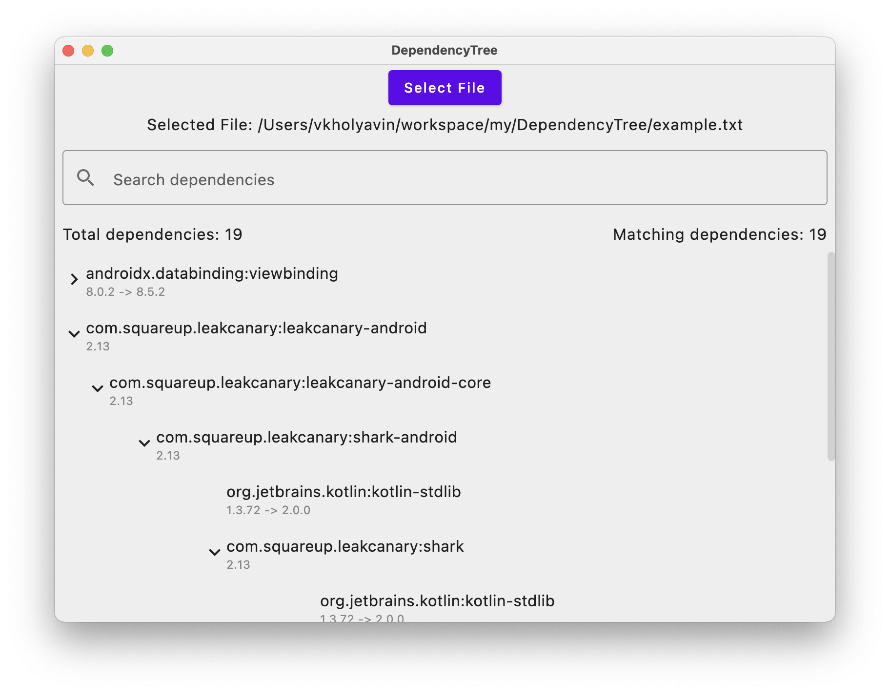

## Disclaimer: This project AI generated. Even this readme was generated

# Dependency Tree Viewer

A Kotlin-based desktop application for visualizing and analyzing dependency trees using Compose Desktop.

## Overview

This application provides an interactive visualization of dependency trees, specifically designed for examining Gradle/Maven dependency outputs. It offers features like search, filtering, and version tracking to help developers understand and analyze their project dependencies.

## Features

- **Interactive Tree Visualization**
  - Collapsible/expandable nodes
  - Visual hierarchy with indentation
  - Clear version transition indicators (-> arrows)
  - Smooth animations for tree operations

- **Advanced Search Capabilities**
  - Real-time filtering
  - Highlights matching text
  - Preserves tree structure during search
  - Auto-expands relevant branches

- **Version Tracking**
  - Shows original versions
  - Displays version transitions
  - Tracks circular dependencies

- **User Interface**
  - Clean, modern Material Design
  - Responsive layout
  - Custom scrollbar for desktop
  - Keyboard navigation support

## Input Format

The application accepts dependency trees in the following [format](example.txt)

